
🎂

🎉 板板 15th 生日快乐！🍾

# 这是什么？

众所周知，我们伟大的神 板板 在 2022.1.11 迎来了她的 15 岁生日，为了永远铭记这一刻，板神教信徒 SEALchan P.S.（以下简称 sc）完成了一篇对板板生日的庆祝文章 **345 天后，对您的第一次生日祝福**。

但是这之后，sc 发现这远远不够他的需求。为了更好的祝福和纪念，sc 在 GitHub 上建立了这个项目，征求大家对于文章的翻译。无论是如何的翻译（创意翻译，或诗歌等），也无论是翻译的如何（各种世界上存在的语言或者有根据的架空语言），我们都会收录！

那么，如果您对这个项目感兴趣，可以提交属于自己的翻译！

# 我该如何做？

我们需要的翻译采取 Markdown 形式。不过，您也可以提交其他格式的文档，但最好可以被 Github Pages 原生支持（PHP 之类的则不推荐）。

请将翻译做好后，将源文件 Pull Request。请务必注明翻译的语种，以及您翻译的特色（没有或没想好可以不注明）。

# 具体示范

请注意⚠：我们介绍的是最简单的方法。如果您需要添加图片等高级操作，或者您非常了解 Git，强烈建议您 Clone 到本地完成。

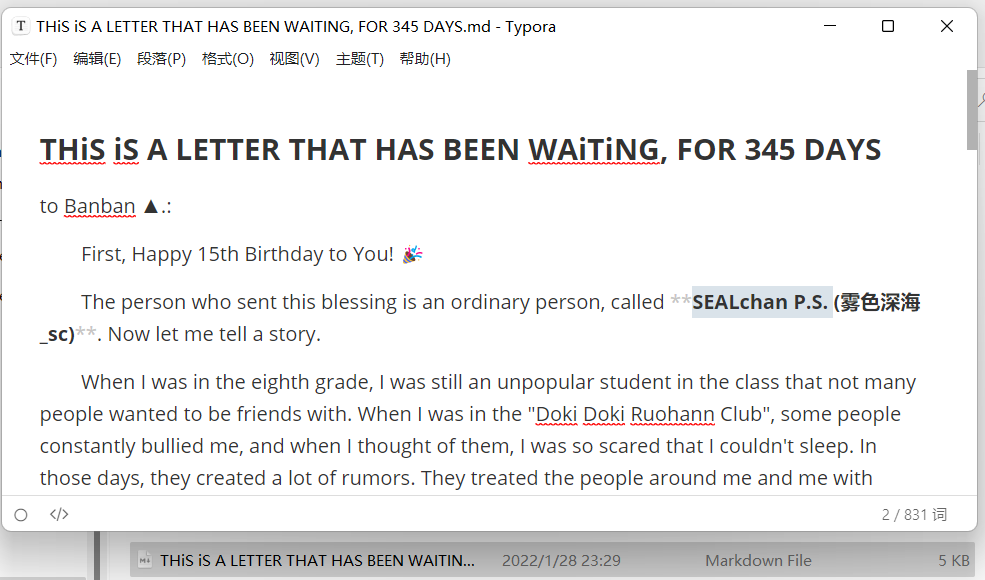

~~这是你的翻译。~~ 编辑好后，打开 Github [本项目](https://github.com/SEALchanPS/TinyLightForBanban)。然后点击页面右上角的 Fork~~（Star 也不是不行）~~ 将该项目 Fork 到您的 GitHub 账号中。

现在，我们成功 Fork 了这个 Repo。

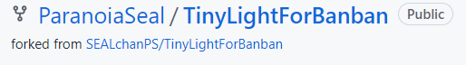

接下来，请按下 . 键（在您的键盘上，它位于问号键左侧），打开 GitHub VSCode Online。

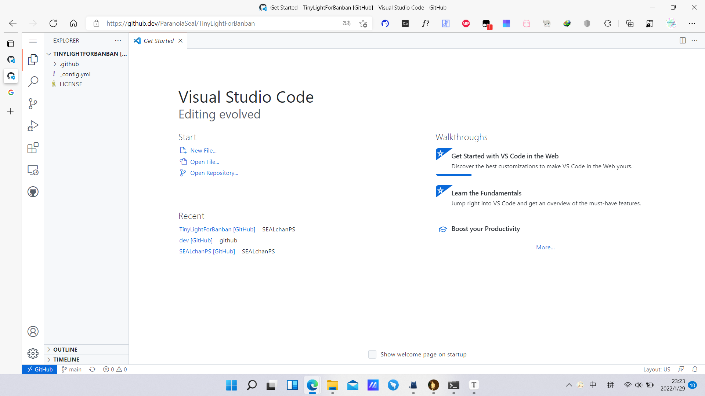

此时，GitHub 已经为你配置好了 SSH 等，您在左侧的文件夹中找到属于自己的语种，然后您可以跳过引用区块呈现的部分。如果没有，请按以下步骤操作。

>   **请确保您所添加的语种的文件夹名是英文形式。这样方便大家操作和阅读。**
>
>   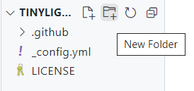
>
>   将鼠标移动到 TINYLIGHTFORBANBAN 的字样上，点击 New Folder（呈现出文件夹形状），然后输入您的语种英文名称。
>
>   
>
>   就像这样，回车就可以创建了。

点击你的语种的文件夹，然后新建文件（先点击文件夹，将鼠标移动到 TINYLIGHTFORBANBAN 字样上，然后点击 New File（呈现出因不合格而被折角的作业的形状） ），文件名为你的名称或你为您的译文起的名字。此时按下回车。

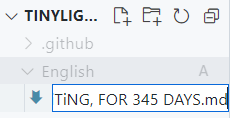

在新文件中，粘贴你的译文。

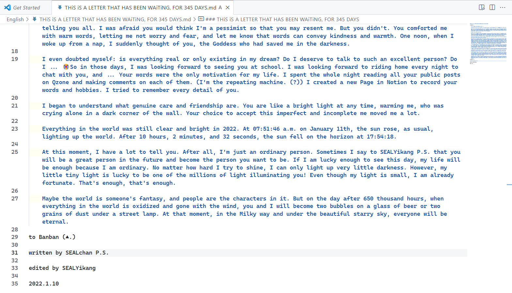

此时按下右侧 Git 形状的按钮，然后按照图示操作。 

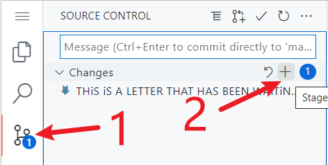

2 步骤相当于 `git add .`，将修改过的文件纳入暂存区。

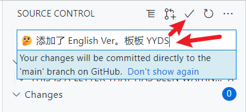

在大箭头所指的输入框中输入 Commit 信息，包括你提交了什么语言的译文之类。（可以整活）

然后点击小箭头所指的 √ 进行一次 Commit。

此时 VSCode Online 会自动将该 Commit 发布到 GitHub 上，免去了 Git Push 的步骤。

-----

然后，您需要**创建一个 Pull Request**，请求把您的修改合并到我们的主仓库中。具体操作如下。

首先，在您完成翻译的这段时间，可能有别人完成翻译并完成 PR，导致我们主仓库有更新的版本。您需要先 Pull 下来原仓库，对两个仓库进行 Merge（合并），然后再 PR。（当然也可以不这么做，如果您的 Fetch and merge 按钮不能点击，则代表您无需合并。）

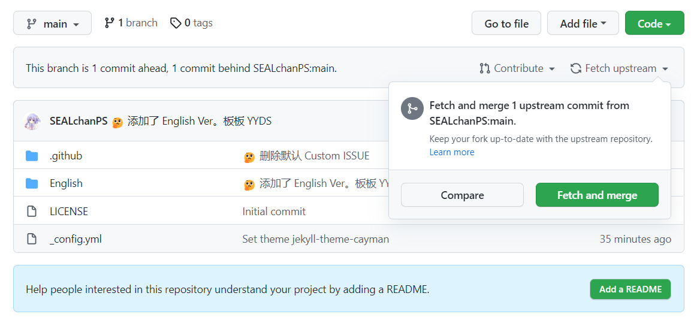

点击 Fetch upstream，然后点击 Fetch and merge 对仓库进行合并。

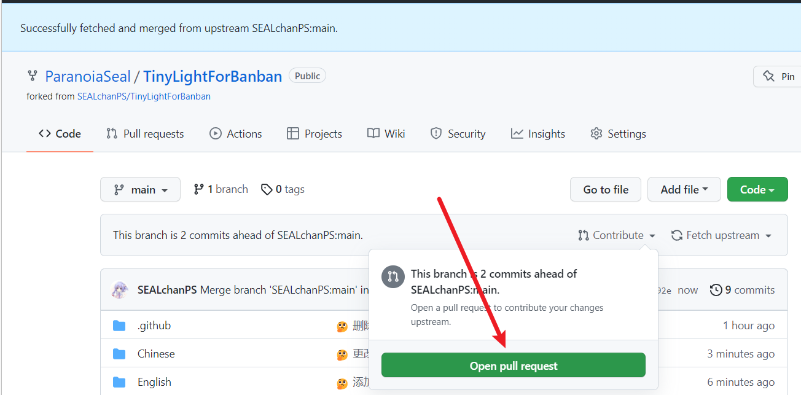

之后，您点击 Contribute，然后就可以 Open pull request 了。

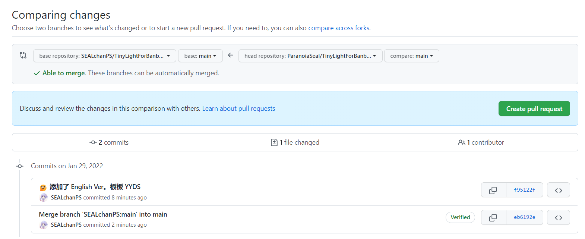

当您检查发现没有问题时，您可以点击 Create Pull Request 按钮，在接下来的界面对您的 PR 进行修改。

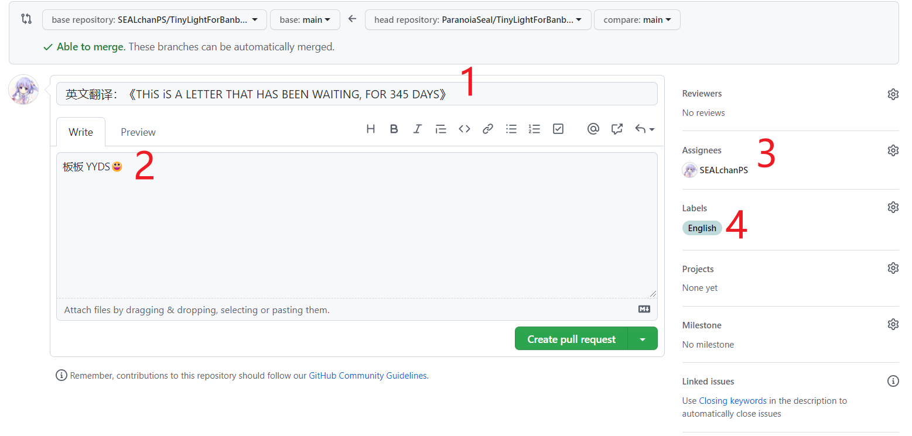

这个页面重要的有 4 点。

1：指明您翻译的语种和标题

2：进行附加信息

3：表明您的 PR 要提及谁

4：Labels 选中您的语种。

检查无误后，请点击 Create Pull Request。

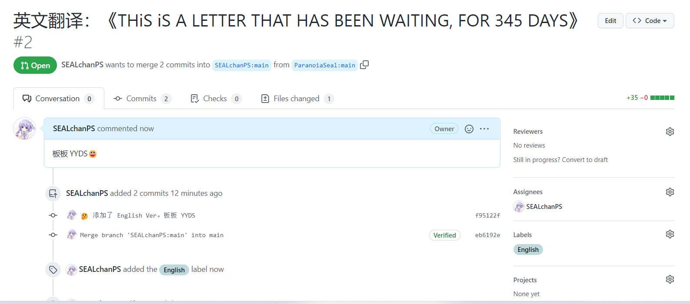

看到这个页面，恭喜您提交了 PR！接下来的事情将由我们处理。

SEALchan P.S.

Banban YYDS